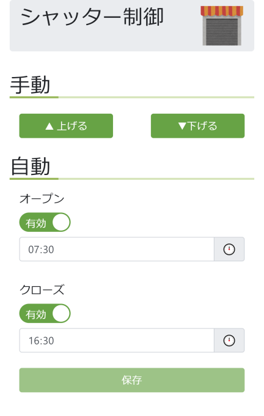

# rasp-shutter
a
ESP32 で制御できるようにした電動シャッターを制御するアプリです．

## 機能

- スマホやパソコンから電動シャッターの制御が行えます．
- スケジュール機能を使って自動開閉が行えます．

## 構成

Vue で作られた UI と，Flask で作られたアプリケーションサーバで構成
されます．ESP32 の REST API を叩いて電動シャッターの制御を行います．

スケジュール機能は cron ファイルを読み書きして実現しています．

ESP32 のソフト関係は[ブログ](https://rabbit-note.com/2019/03/17/shutter-automation/)で紹介しています．

## スクリーンショット



## カスタマイズ

ESP32 の REST API のアドレスは flask/config.py にて定義していますので，
ここを書き換えることで制御方法を変えることができます．

## 準備

### ライブラリのインストール

```bash:bash
sudo apt install npm
sudo apt install python3-pip
sudo apt install python3-flask
sudo pip3 install python-crontab
```

Ubuntu 18.04 の場合，apt install python3-crontab でインストールしたライブラ
リだとバージョンが古いのでエラーが出ます．

## ビルド方法

```bash:bash
npm install
npm run build
```

## 実行方法

```bash:bash
python3 flask/app.py
```
