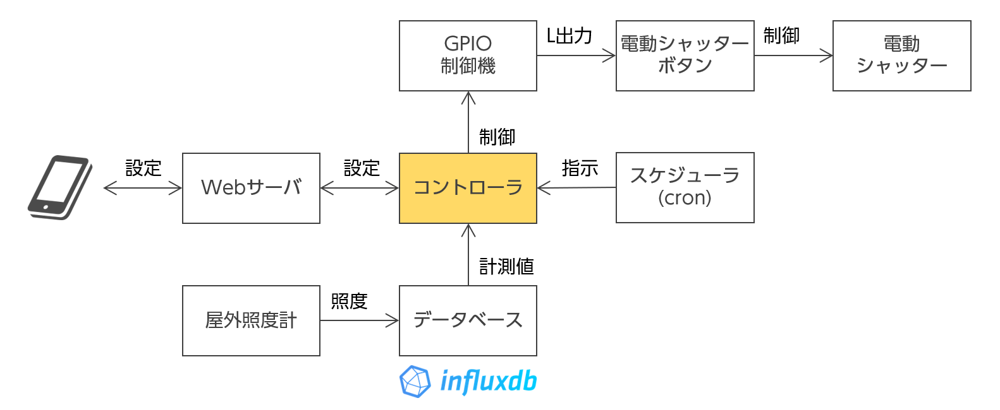

# rasp-shutter

電動シャッターを自動制御するアプリです。

## 機能

-   スマホやパソコンから電動シャッターの制御が行えます。
-   スケジュール機能を使って自動開閉が行えます。
-   屋外の明るさに応じて、指定間よりも早く自動でシャッターを下ろせます。

## システム構成

Vue で作られた UI と、Flask で作られたアプリサーバで構成されます。
ESP32 の REST API を叩いて電動シャッターの制御を行います。

ESP32 のソフト関係は[ブログ](https://rabbit-note.com/2019/03/17/shutter-automation/)で紹介しています。



## デモ

下記で、擬似的にシャッターを操作できます。

https://rasp-shutter-demo.kubernetes.green-rabbit.net/rasp-shutter/


## 動作環境

基本的には，Python が動作する環境であれば動作します。
下記の環境での動作を確認しています。

- Linux (Ubuntu 24.04)
- Kubernetes

## 設定

同封されている `config.example.yaml` を `config.yaml` に名前変更して，お手元の環境に合わせて書き換えてください。

## 動かし方

### Linux の場合

#### 準備

```bash:bash
sudo apt install npm docker
```

#### 実行

```bash:bash
npm ci
npm run build

docker compose run --build --rm --publish 5000:5000 rasp-shutter
```

#### Docker を使いたくない場合

[Rye](https://rye.astral.sh/) と Google Chrome がインストールされた環境であれば，
下記のようにして Docker を使わずに実行できます．

```bash:bash
rye sync
rye run python flask/src/app.py
```

### Kubernetes の場合

Kubernetes で CronJob を使って定期的に実行するため設定ファイルが `kubernetes/rasp-shutter.yaml` に入っていますので，
適宜カスタマイズして使っていただければと思います。

## テスト結果

-   https://kimata.github.io/rasp-shutter/
-   https://kimata.github.io/rasp-shutter/coverage/

# ライセンス

Apache License Version 2.0 を適用します。
