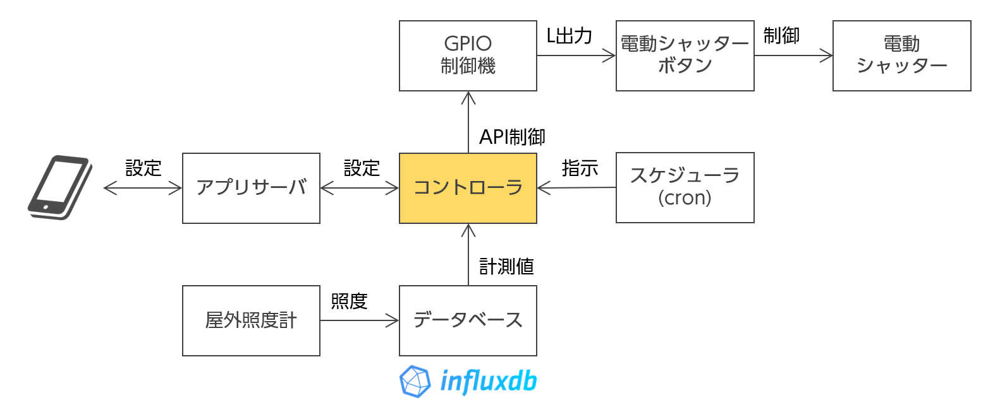

# rasp-shutter

電動シャッターを自動制御するアプリです．

## 機能

-   スマホやパソコンから電動シャッターの制御が行えます．
-   スケジュール機能を使って自動開閉が行えます．
-   屋外の明るさに応じて，指定間よりも早く自動でシャッターを下ろせます．

## システム構成

Vue で作られた UI と，Flask で作られたアプリサーバで構成されます．
ESP32 の REST API を叩いて電動シャッターの制御を行います．

スケジュール機能は cron ファイルを読み書きして実現しています．

ESP32 のソフト関係は[ブログ](https://rabbit-note.com/2019/03/17/shutter-automation/)で紹介しています．



## デモ

下記で，擬似的にシャッターを操作できます．

https://rasp-shutter-demo.kubernetes.green-rabbit.net/rasp-shutter/

## カスタマイズ

ESP32 の REST API のアドレスは flask/config.py にて定義していますので，
ここを書き換えることで制御方法を変えることができます．

## 準備

### ライブラリのインストール

```bash:bash
poetry install
```

Ubuntu 18.04 の場合，apt install python3-crontab でインストールしたライブラ
リだとバージョンが古いのでエラーが出ます．

## ビルド方法

```bash:bash
npm ci
npm run build
```

## 実行方法

```bash:bash
poetry run python3 flask/app.py
```

## テスト結果

-   https://kimata.github.io/rasp-shutter/
-   https://kimata.github.io/rasp-shutter/coverage/
