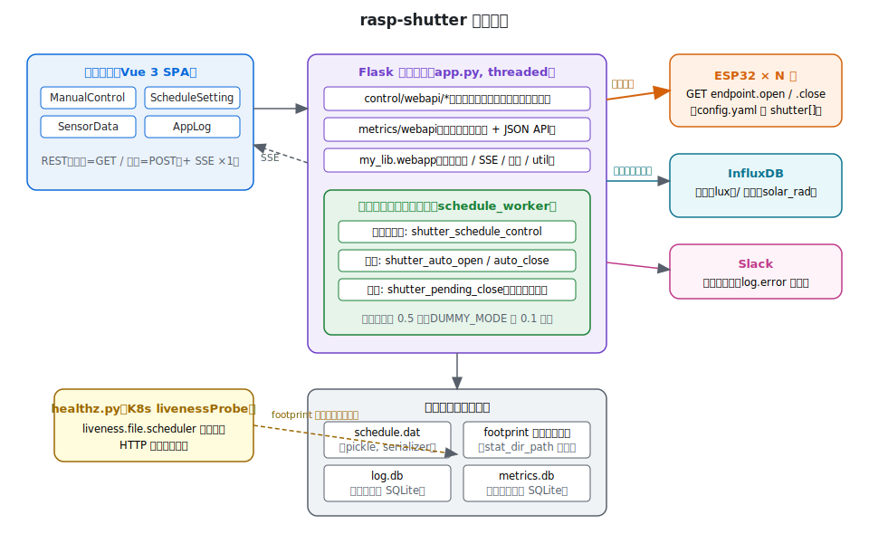
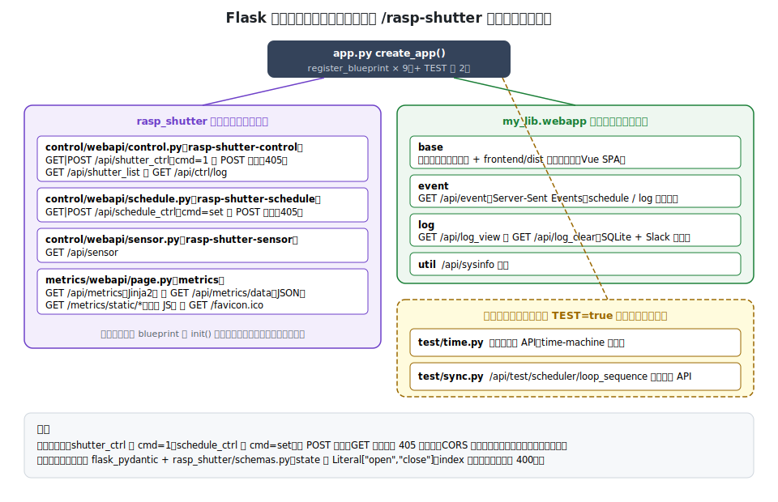
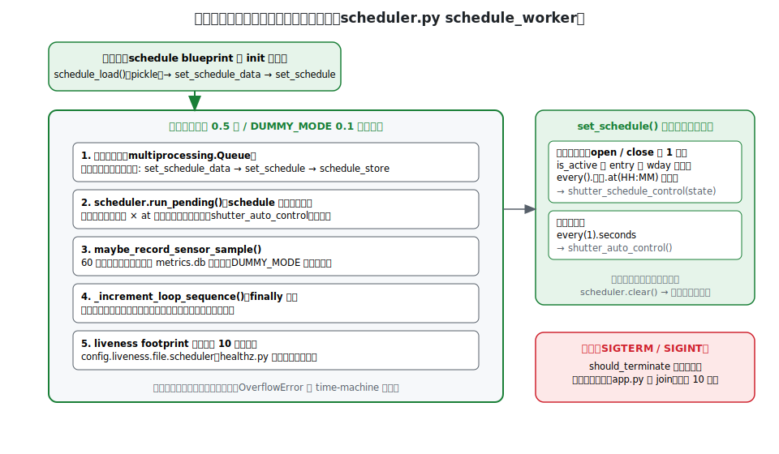
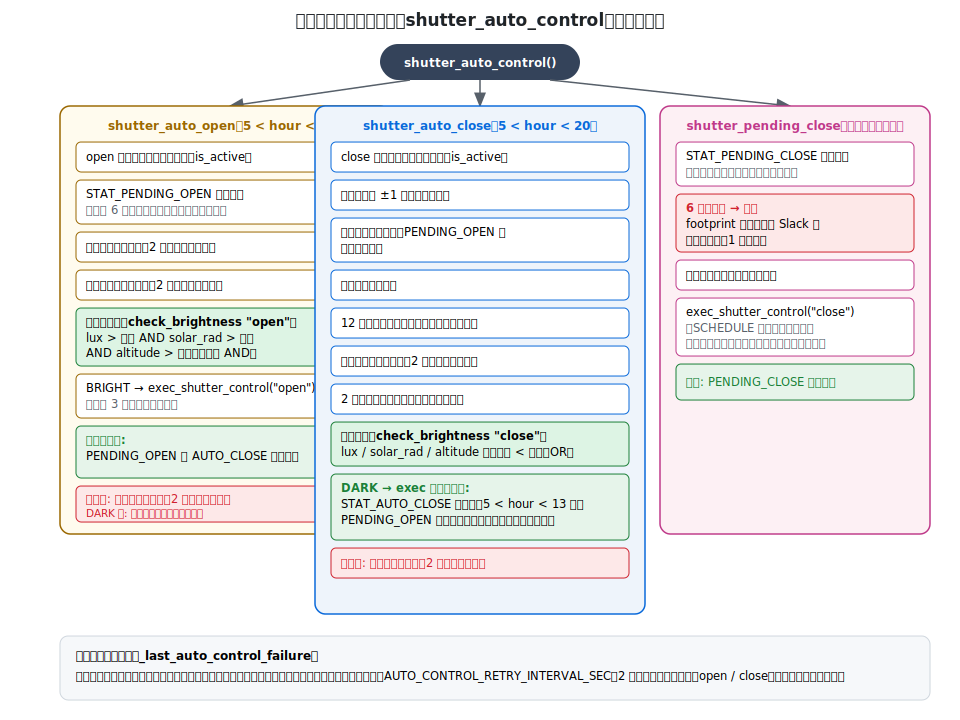
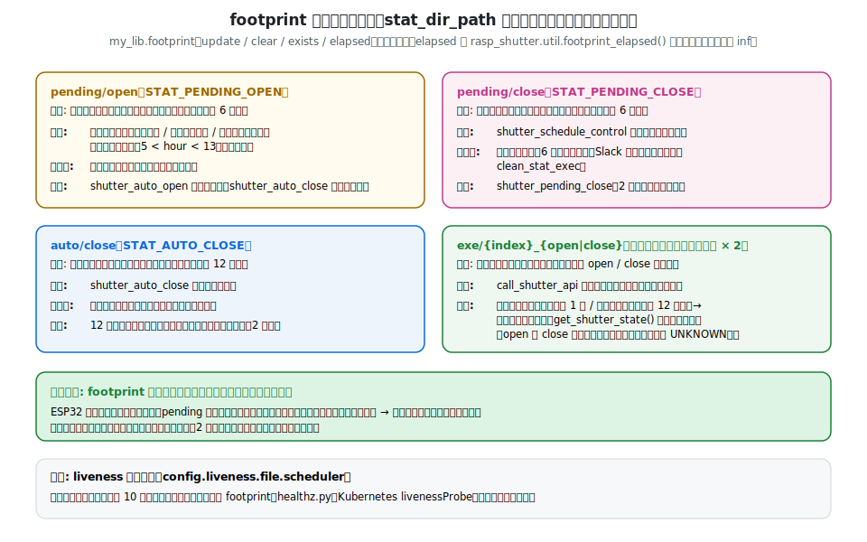
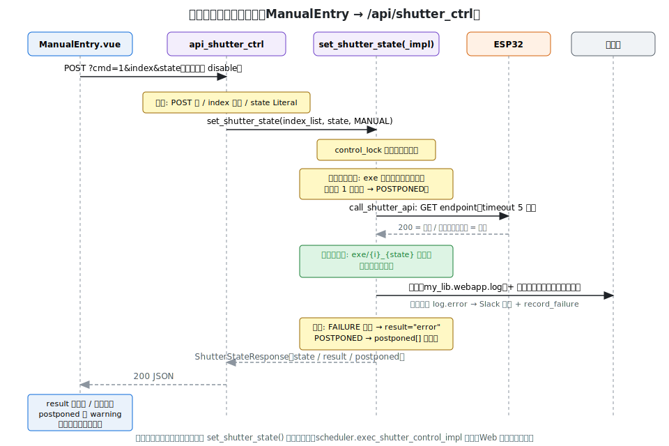
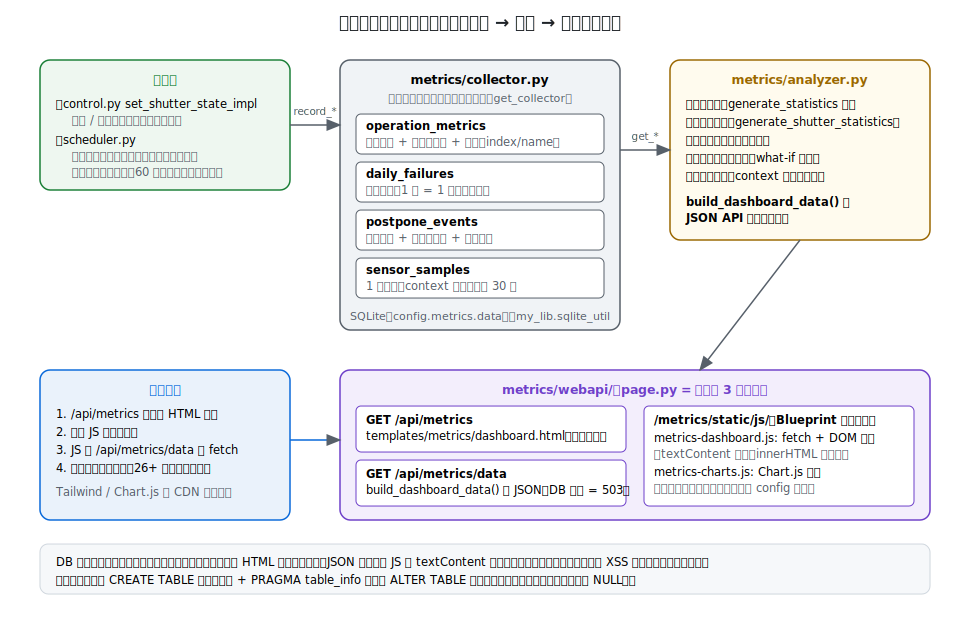
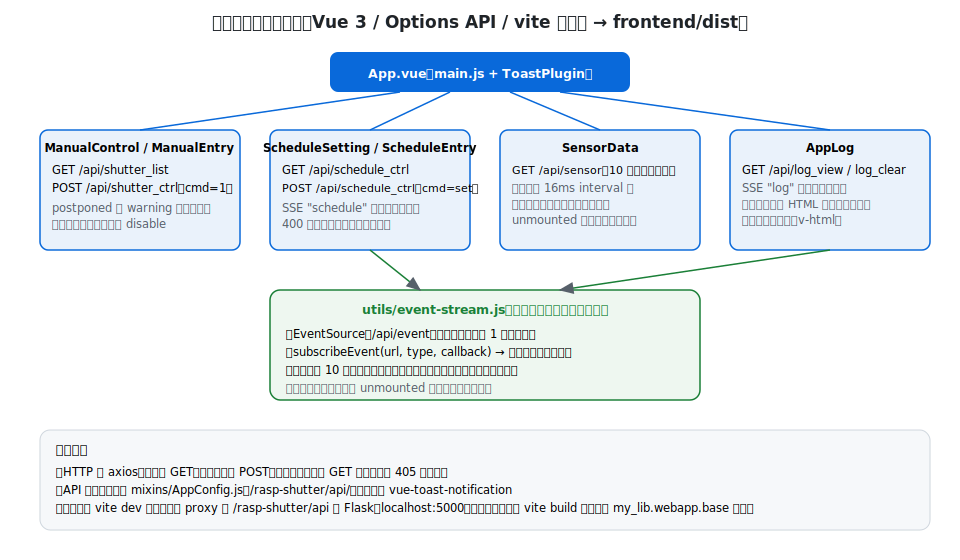

# アーキテクチャ

rasp-shutter は、スケジュールと照度・日射センサーに基づいて電動シャッターを自動開閉するアプリケーションです。
Vue 3 の SPA と Flask バックエンドで構成され、ESP32 デバイスに REST でシャッターの開閉を指示します。

このドキュメントは実装（`src/` / `frontend/src/`）に基づいてコード構造を説明します。

## 全体構成



1 つの Flask プロセス（`src/app.py`）の中に、Web API を処理する Flask のワーカースレッド群と、
自動制御を行う**スケジューラスレッド 1 本**（+ センサーサンプリング用の使い捨てスレッド）が同居します。

| 外部システム | 通信 | 用途 |
| --- | --- | --- |
| ESP32（シャッターごとに open/close の 2 URL） | HTTP GET（timeout 5 秒） | シャッターの開閉指示 |
| InfluxDB | `my_lib.sensor_data.fetch_data`（timeout 3 秒） | 照度（lux）・日射（solar_rad）の取得 |
| Slack | `my_lib.webapp.log.error` 経由 | エラー通知（インターバル抑制付き） |

ローカルには 4 種類のデータを永続化します（いずれも `config.yaml` でパス指定）。

- **schedule.dat** — スケジュール設定（`my_lib.serializer` による pickle）
- **footprint 状態ファイル** — 制御状態のタイムスタンプ（後述）
- **log.db** — 実行ログ（`my_lib.webapp.log` の SQLite）
- **metrics.db** — メトリクス（`rasp_shutter.metrics.collector` の SQLite）

## エントリポイント

| ファイル | 役割 |
| --- | --- |
| `src/app.py` | Flask アプリの生成（`create_app`）と起動。SIGTERM/SIGINT でスケジューラスレッドを join して graceful shutdown |
| `src/healthz.py` | Kubernetes livenessProbe 用。スケジューラが更新する liveness ファイルの鮮度と HTTP ポートを検査 |

`create_app()` は `DUMMY_MODE` 環境変数を設定**してから** control 系モジュールを import します
（`control.py` がモジュールロード時に `DUMMY_MODE` を参照してダミー用ルートを登録するため）。
スケジューラスレッドは schedule ブループリントの `init()`（`control/webapi/schedule.py`）から起動されます。

## Flask ブループリント構成



すべてのルートは `/rasp-shutter` プレフィックス（`rasp_shutter.config.URL_PREFIX`）配下です。

- **状態変更 API は POST 限定**です。`/api/shutter_ctrl` の `cmd=1` と `/api/schedule_ctrl` の `cmd=set` を
  GET で呼ぶと 405 を返します。CORS は使用しません（フロントエンドが同一オリジンで配信されるため）。
- リクエスト検証は `flask_pydantic` + `src/rasp_shutter/schemas.py` で行います。
  `state` は `Literal["open", "close"]`、`index` は `-1`（全シャッター）または範囲内のみ許可（違反は 400）。
- スケジュールの JSON はパース失敗・キー名不正（`open`/`close` 以外）・型不正で 400 を返します
  （検証本体は `scheduler.schedule_validate`）。

## スケジューラスレッド



`src/rasp_shutter/control/scheduler.py` の `schedule_worker()` が本体です。
Python の [schedule](https://schedule.readthedocs.io/) ライブラリに 2 種類のジョブを登録し、
0.5 秒間隔（`DUMMY_MODE` では 0.1 秒）でループします。

- **時刻ジョブ** — スケジュール設定の `open` / `close` エントリごとに、有効な曜日 × `at(HH:MM)` で登録。
  実行内容は `shutter_schedule_control(state)`
- **毎秒ジョブ** — `shutter_auto_control()`。時間帯に応じて自動開け・自動閉め・閉め再試行を行う

Web API（`/api/schedule_ctrl`）からのスケジュール更新は `multiprocessing.Queue` 経由で
スケジューラスレッドに渡り、ジョブの再登録（`set_schedule`）と永続化（`schedule_store`）が行われます。
Flask スレッドとスケジューラスレッドがスケジュールデータを直接共有しないため、
ジョブ登録の競合が発生しません。

ループはテスト同期用のシーケンス番号を毎回インクリメントし（`_increment_loop_sequence`）、
キューからスケジュールを取り込んでジョブ登録を終えるたびに適用世代番号を進めます
（`_increment_schedule_applied_generation`。テストはこれで「保存したスケジュールが
適用された」ことを確認してから時刻を操作する）。
約 10 秒ごとに liveness ファイルを更新します。例外はループ内で捕捉して継続します。

## 自動制御ロジック



`shutter_auto_control()` は毎秒、次の 3 つを実行します。

### shutter_auto_open（5 時台の次〜11 時台）

「暗くて開けるのを延期した」状態（`STAT_PENDING_OPEN`、有効 6 時間）があるときだけ動作します。
明るさ判定は **AND 条件**（`lux > 閾値 かつ solar_rad > 閾値 かつ altitude > 閾値`）で、
満たせば開け制御を実行します。

### shutter_auto_close（5 時台の次〜19 時台）

スケジュールの閉め時刻より**前**に暗くなった場合の先回りクローズです。
暗さ判定は **OR 条件**（いずれかのセンサーが閾値未満）。
成功すると `STAT_AUTO_CLOSE`（12 時間の再クローズ抑制）を記録し、
再び明るくなる可能性がある時間帯（〜12 時台）なら `STAT_PENDING_OPEN` を設定して
自動再オープンに備えます。

### shutter_pending_close（時間帯によらず）

スケジュールの閉め制御が失敗すると、閉め時刻を過ぎているため通常経路では誰も再試行しません。
このため失敗時に `STAT_PENDING_CLOSE` を設定し、リトライ間隔ごとに再試行します。
6 時間で諦め、その際に一度だけ Slack へエラー通知します。

### 失敗時の共通ルール

- `exec_shutter_control()` は最大 3 回即時リトライし、全滅でログに失敗を残します
- 失敗直後の毎秒再試行を防ぐため、アクション別（open / close）に
  `AUTO_CONTROL_RETRY_INTERVAL_SEC`（2 分）の再試行抑制が入ります
- スケジュール開け制御の失敗は `STAT_PENDING_OPEN` を設定して `shutter_auto_open` の経路で
  再試行します（見合わせメトリクスに `reason="control_failure"` で記録）

## footprint による状態管理



制御状態は DB ではなく、`my_lib.footprint` による**タイムスタンプファイル**
（`config.webapp.data.stat_dir_path` 配下）で管理します。
パス定義は `src/rasp_shutter/control/config.py` に集約されています。

| ファイル | 意味 | 有効期間 |
| --- | --- | --- |
| `pending/open` | 開けたいが開けられていない（暗い・センサー不明・制御失敗） | 6 時間 |
| `pending/close` | スケジュール閉め制御に失敗した（再試行待ち） | 6 時間 |
| `auto/close` | 暗くなったので自動で閉めた | 12 時間 |
| `exe/{index}_{open\|close}` | 各シャッターで最後に**成功**した操作の時刻 | 制御間隔チェックに使用 |

重要な設計原則は 2 つです。

1. **footprint は制御が実際に成功したときだけ進める。**
   失敗時に pending をクリアしたり履歴を更新したりすると、自動リカバリ経路が失われます。
2. **経過時間の参照は `rasp_shutter.util.footprint_elapsed()` を経由する。**
   ファイル欠如・破損時は `math.inf` を返し、「無限に古い」として安全側に判定されます。

`exe/` の履歴は 2 つの用途に使われます。

- **制御間隔チェック** — 同方向の操作が短時間に連続した場合は「見合わせ」
  （手動 1 分・スケジュール/自動 12 時間。`control.py` の `MODE_INTERVAL_CONFIG`）
- **開閉状態の推定** — `get_shutter_state()` は open/close 履歴の新しい方を現在状態とみなします
  （どちらもなければ `UNKNOWN`。実機の状態は取得していない点に注意）

## 制御実行経路



手動・スケジュール・自動のいずれも、最終的に `control/webapi/control.py` の
`set_shutter_state()` に合流します（スケジューラは Web を経由せず関数を直接呼びます）。

- `control_lock` で制御全体を直列化
- シャッターごとに `set_shutter_state_impl()` が `EXEC_RESULT`（SUCCESS / POSTPONED / FAILURE）を返す
- `call_shutter_api()` が ESP32 の endpoint を GET（`DUMMY_MODE` では何もせず成功扱い）
- 成功時のみ `exe/` 履歴を更新し、逆方向の履歴をクリア
- 結果はログ（`my_lib.webapp.log`、失敗時は Slack 通知）とメトリクス（シャッター個体別）に記録
- レスポンスの `result` は 1 台でも失敗すると `"error"`、見合わせたシャッター名は `postponed` に入る

## センサーデータ取得

`control/webapi/sensor.py` の `get_sensor_data_impl()` が実体です。

- `lux` / `solar_rad` は InfluxDB から直近 1 時間の最新値を取得（`my_lib.sensor_data.fetch_data`）
- `altitude`（太陽高度）は pysolar により `config.location`（緯度・経度）と UTC 現在時刻から計算
- 結果は `rasp_shutter.type_defs.SensorData`（`SensorValue` は `valid` フラグ付き）

公開関数 `get_sensor_data()` は impl への薄い委譲です。
テストではセッションスコープのモックが `get_sensor_data` を置換するため、
実装のユニットテスト（`tests/unit/test_sensor_logic.py`）は impl を直接対象にします。

## メトリクス



記録（collector）・集計（analyzer）・表示（webapi + 静的 JS）の 3 層に分かれています。

### collector（`src/rasp_shutter/metrics/collector.py`）

SQLite に 4 テーブルを持ちます。

| テーブル | 内容 |
| --- | --- |
| `operation_metrics` | 操作（open/close × manual/schedule/auto）+ 当時のセンサー値 + シャッター個体 |
| `daily_failures` | 制御失敗（1 行 = 1 件、シャッター個体別） |
| `postpone_events` | 見合わせ（理由・当時のセンサー値と**閾値スナップショット**・解消時刻） |
| `sensor_samples` | 1 分間隔のセンサー値（context: auto_open_window / auto_close_window / off_hours）|

- `get_collector()` はモジュールレベルの Lock で保護されたシングルトン
  （スケジューラ・サンプリング・Flask の 3 系統のスレッドから呼ばれるため）
- `sensor_samples` は保持期間 30 日（`SENSOR_SAMPLE_RETENTION_DAYS`）。日付が変わったタイミングで自動削除
- スキーマ変更は `CREATE TABLE` への列追加 + `PRAGMA table_info` による
  `ALTER TABLE` マイグレーション（無停止、過去行は NULL）

### analyzer（`src/rasp_shutter/metrics/analyzer.py`）

集計・分析の純粋ロジックです。`build_dashboard_data(collector, current_schedule)` が
JSON API のレスポンス全体を組み立てる唯一の入口です。
閾値チューニング分析（`analyze_threshold_tuning`）は見合わせイベントに保存された
閾値スナップショットを使い、「閾値を下げたら何件が即時開けられたか」の what-if 試算を行います
（判定条件は `scheduler.check_brightness` の open 判定と同じ AND 条件を再現）。

### webapi（`src/rasp_shutter/metrics/webapi/`）

- `page.py` — ルート 3 本のみ（ページ / JSON API / favicon）。favicon は PIL 生成を `lru_cache` でキャッシュ
- `templates/metrics/dashboard.html` — 骨格のみの Jinja2 テンプレート（DB 由来データは含まない）
- `static/js/metrics-dashboard.js` — `/api/metrics/data` を fetch して DOM を描画（textContent のみ使用）
- `static/js/metrics-charts.js` — Chart.js の描画。同型のヒストグラム群はデータ駆動の config 配列で定義

## フロントエンド



Vue 3（Options API）+ vite です。ビルド成果物（`frontend/dist`）を
`my_lib.webapp.base` の静的配信ブループリントが配ります。

- 4 つの機能コンポーネント（ManualControl / ScheduleSetting / SensorData / AppLog）を
  `App.vue` が並べる単一ページ構成
- サーバーイベント（SSE `/api/event`）は `utils/event-stream.js` の**モジュールシングルトン**が
  1 本だけ接続を張り、`subscribeEvent()` で購読を配ります。切断時は 10 秒後に自動再接続、
  購読者ゼロで接続とタイマーを解放します
- 状態変更はすべて `axios.post`。制御レスポンスの `postponed` により
  「見合わせ」を warning トーストで区別表示します
- ログメッセージは HTML エスケープしてから装飾タグを挿入（`v-html` の XSS 対策）
- 開発時は `vite.config.ts` の proxy が `/rasp-shutter/api` を Flask（localhost:5000）へ中継

## 設定

`config.yaml`（スキーマ検証: `config.schema`）を `src/rasp_shutter/config.py` が
**frozen dataclass** 群（`AppConfig`）にパースします。

```
AppConfig
├── webapp        静的配信パス、schedule.dat / log.db / stat_dir のパス
├── sensor        InfluxDB 接続情報、lux / solar_rad の測定点（measure, hostname）
├── location      緯度・経度（太陽高度の計算に使用）
├── metrics       metrics.db のパス
├── liveness      スケジューラの liveness ファイルパス
├── shutter[]     シャッター名と ESP32 の open/close エンドポイント URL
└── slack         エラー通知設定
```

時間・パスに関する定数（自動制御の時間帯、リトライ間隔、footprint パスなど）は
`src/rasp_shutter/control/config.py` に集約されています。

## デプロイ

- **Docker** — `Dockerfile` はソースツリーをそのままコピーし `./src/app.py` を実行
  （`compose.yaml` あり）。テンプレート・静的ファイルもツリーごと配置されるため追加設定は不要
- **Kubernetes** — `kubernetes/rasp-shutter.yml`。livenessProbe が `healthz.py` を exec 実行し、
  スケジューラスレッドの liveness footprint の鮮度を検査

## テストの構造（概要）

`tests/` は unit / integration / e2e の 3 層構成です。pytest-xdist の並列実行に対応するため、
スケジューラ・ロック・キュー・制御履歴などがワーカー ID をキーにした dict で分離され、
スケジューラのループシーケンス番号を使った同期 API（`TEST=true` 時のみ登録）で
time-machine による時刻操作とスケジューラの実行を同期させます。
詳細な運用ルールは [CLAUDE.md](../CLAUDE.md) の「並列テスト実行」を参照してください。
